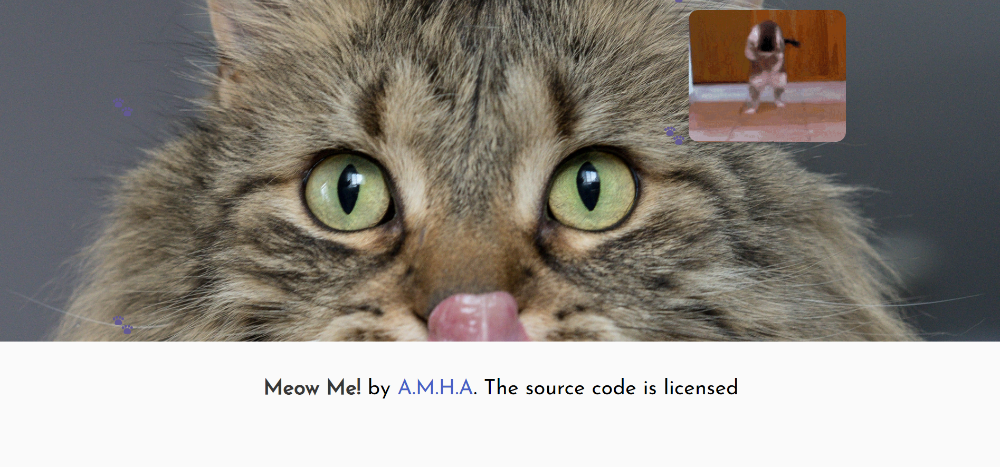

# Meow-Me 😺
Meow Me is the only app you need!!

## Link to deployed application:
https://aaronf87.github.io/Meow-Me/

## Project Description

We all know the daily stress that comes with being a working individual and it can be hard to find time to destress without falling into the rabbit hole of anxiety-inducing social media. Meow Me is here to help you destress and get back to work. Its great for those with a few minutes to spare at work. Meow Me is a cat content app that allows you to view cat videos and cat gifs on the same page. 

User Story:

AS A stressed out cat individual
I WANT to take some time to destress during my day and view cat content
SO THAT I can destress, use the rest of my time efficiently, and be productive afterwards.

## Features

Load and "Meow Me" button to load the videos from Youtube API. Gifs are preloaded onto the page. 

Day and time using Day.js

Gifs loaded from Giphy API

## Technologies Used

APIs:
Youtube API and Giphy API

CSS Framework: Bulma

## Screenshots of Application

